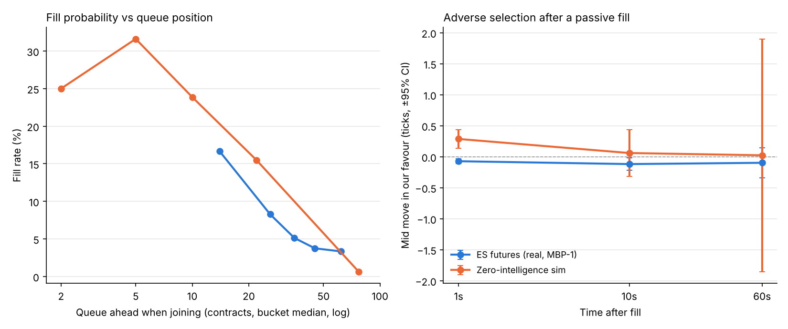

# lob-simulator

**Question:** How does a price-time priority order book behave, and what are the real fill probability and adverse selection for a passive order, given where it sits in the queue?

Two parts:
1. **A matching engine** (limit, market, cancel, partial fills, price-time priority, L2 snapshots) driven by zero-intelligence order flow.
2. **A queue-position experiment** run on the synthetic flow **and on 22 days of real CME E-mini S&P 500 (ES) top-of-book data** (Databento MBP-1, 24 Aug – 23 Sep 2026, US regular hours).

## Result



**ES, 33,836 hypothetical 1-lot passive orders (every 30 s, both sides, 22 days):**

| Outcome | Share |
|---|---|
| Filled (prints at our price exceeded the queue ahead) | **7.4%** |
| Pulled (touch moved away, or 5-min timeout) | 49.9% |
| Ambiguous (level cleared without enough prints, meaning cancels ahead of us) | 42.7% |

| Queue ahead when joining (contracts) | 1–20 | 20–31 | 31–39 | 39–52 | 52+ |
|---|---|---|---|---|---|
| Fill rate | 16.7% | 8.3% | 5.1% | 3.8% | 3.3% |

| Mid move after fill, in our favour (ticks) | 1 s | 10 s | 60 s |
|---|---|---|---|
| ES (2,514 fills) | **−0.07 ± 0.04** | −0.12 ± 0.10 | −0.10 ± 0.24 |
| Zero-intelligence sim (150 fills) | +0.29 ± 0.15 | +0.06 ± 0.38 | +0.02 ± 1.88 |

(± is a 95% CI.)

**What this says:**
- **Queue position dominates fill probability.** Joining behind 50+ contracts fills about 1 in 30 times on our conservative rule.
- **Real fills are adversely selected.** A passive buy at the bid starts half a tick in our favour against the mid. One second after a fill, ES mid is on average 0.07 ticks *below* our price: the half-spread we "earned" is more than given back. You get filled mostly when the level is being run over. The median time to fill is 0.9 s, so fills cluster right as the level breaks.
- **The ZI simulation shows the opposite sign.** It has no informed traders, so fills there keep their spread capture. The gap between the two lines is a picture of what "informed flow" means. It is also why a naive simulator overstates passive strategies.

## Method

**Matching engine** (`src/lob/book.py`): integer tick prices, a FIFO deque per level, a dict of levels per side. Marketable limit orders execute first and the remainder rests.

**Zero-intelligence flow** (`src/lob/zero_intelligence.py`), loosely after Cont, Stoikov & Talreja (2010):
- Poisson arrivals.
- Limit orders 1–5 ticks from the opposite touch.
- Market orders with geometric sizes.
- Random cancels.
- Output is an MBP-1-style tape in the same schema as the real loader.

**Experiment** (`src/lob/queue_experiment.py`), applied identically to both tapes:
- Every 30 s, join the back of the queue at the best bid and at the best ask. Queue ahead = displayed size.
- **Filled** only when aggressive volume printed *at our price, from the side that hits us*, exceeds the queue ahead (strictly).
- **Pulled** if the touch moves away first, or after 5 minutes.
- **Ambiguous** if the touch moves *through* our price before enough prints. MBP-1 can't say whether the cancels were ahead of us, so these count as not filled and are reported separately. The true fill rate lies between 7.4% and about 50%. That gap is the price of not having order-by-order (MBO) data.

**Real data** (`data/loaders.py::load_real`): Databento GLBX.MDP3 MBP-1 parquet for the front contract (ESU6, then ESZ6 after the roll). Snapshot records are dropped, and the window is 13:30–20:00 UTC. Trade `side` is the aggressor side. Only aggregate tables (`outputs/es_*.csv`) are committed; raw data and per-order rows stay local.

## Tests

`make test` runs 12 tests:

| Test | What it proves |
|---|---|
| Price-time priority | Same price: the earlier order fills first. A better price beats an earlier time. |
| Market sweep across 3 levels | Correct VWAP and remaining book |
| Marketable limit | Partial fill, then the remainder rests correctly |
| Cancel | Removes the right order and updates queue-ahead |
| 10,000 random events (seeded) | Book never crossed, no zero or negative sizes, index consistent |
| Hand-built tapes | Fill exactly when cumulative prints exceed queue ahead. Exactly-equal is not a fill. Wrong side/price ignored. Pulled when the touch moves away. Ambiguous when the level clears. Sell-side mirror and adverse-selection sign. |
| Synthetic tape | Schema matches the real loader; seeded and reproducible |

## Limitations (honest)

- **Queue position is estimated.** MBP-1 has top-of-book only and no order IDs. We assume we join behind *all* displayed size and that no cancels ahead of us help. That makes the fill estimate conservative, and the ambiguous bucket is large.
- No full depth: MBP-1 is not reconstructed into a deeper book, and no hidden or iceberg orders.
- One contract, one month, regular hours only. Fees aren't included in the adverse-selection numbers.
- The ZI model has a known drift and no informed flow. It is a mechanics test bed, not a market model.
- Placements every 30 s overlap, so samples aren't independent and the CIs are optimistic.

## How to run

```bash
make setup   # numpy, pandas, matplotlib, pytest
make test    # 12 tests, <1 s
make demo    # synthetic run + chart (uses committed ES aggregates), ~4 s
```

Re-run on your own Databento MBP-1 parquet (needs `pyarrow`, ~5 s per day):

```bash
make real ES_FILES="/path/date=2026-09-18/instrument=10252/events.parquet ..."
make demo
```

## Possible extensions (not built, on purpose)

MBO data to remove the ambiguous bucket, queue-reactive order flow (Huang, Lehalle & Rosenbaum), fees and rebates in P&L, and a better estimate of where you sit in the queue.
